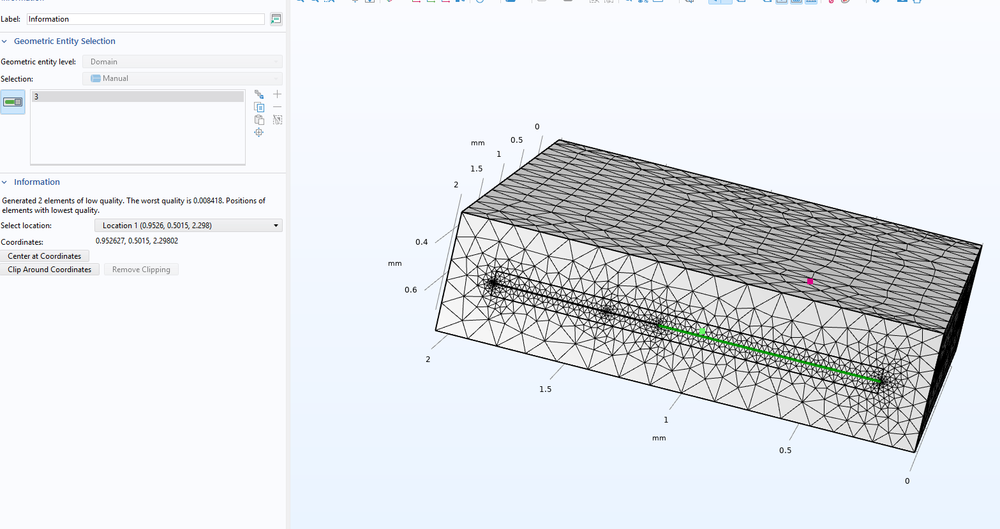
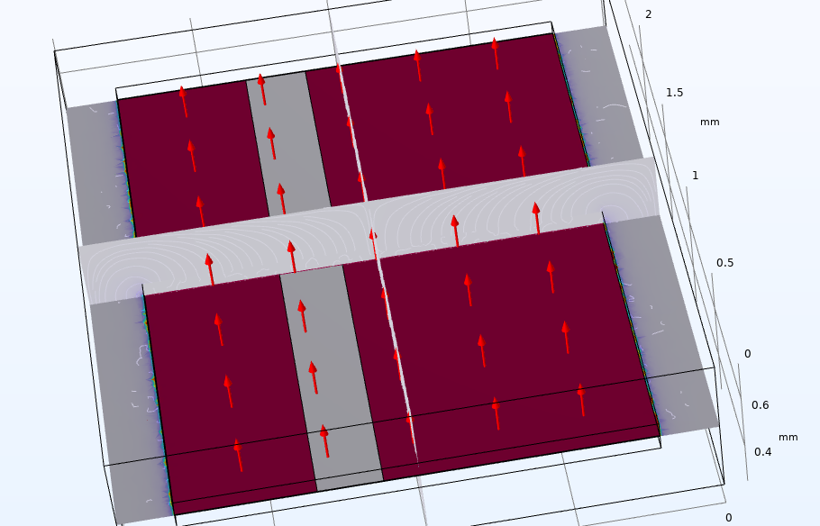
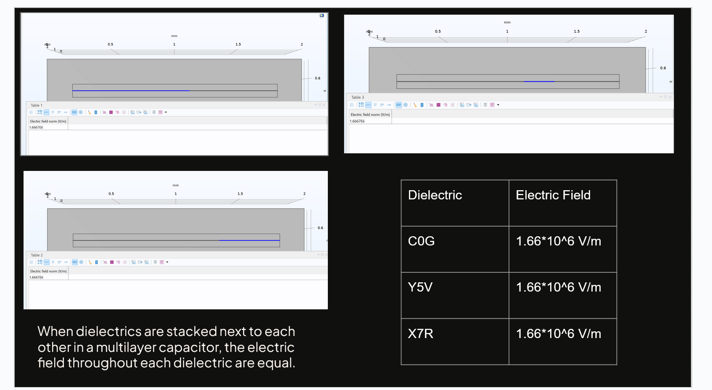

# Multilayer Capacitor Design

A decoupling (MLCC) capacitor design project for filtering high-frequency noise from a power supply — sized for a small board (Raspberry Pi Pico use case). The stack is modeled and solved in **COMSOL Multiphysics 6.3**; the model file [`MLC2_F&W.mph`](MLC2_F&W.mph) is included in this repo.

---

## Overview

A Multilayer Ceramic Capacitor (MLCC) is built from alternating ceramic dielectric layers and metal electrode layers, connected at two (or three) external terminals. This project designs a three-dielectric-layer MLCC stack combining three common dielectric materials, computes each layer's contribution to total capacitance, and simulates the resulting electric field and potential distribution with a 3D electrostatics FEM solve.

Goals for the capacitor:

- Decouple / filter high-frequency noise from the power supply
- Support a steady, reliable power supply (critical to board function)
- Be physically small while keeping capacitance low and controlled

## COMSOL Simulation

### Geometry and mesh

The stack is built from six blocks in a single 3D geometry (`geom1`): the C0G outer shell, the three dielectric layers (C0G, X7R, Y5U), and the two nickel electrode plates (`PWr_Ni` and `GRND_Ni`). The mesh is refined around the thin dielectric layers, where the field gradient is steepest.



### Electric field

With +5 V on the power plate and 0 V on the ground plate, the electric field vectors (red arrows) point from the signal plate toward the ground plate, straight through the dielectric layers.



### Field equality across the stack

Evaluating the electric field norm inside each of the three dielectrics returns the same value — **1.6667 × 10⁶ V/m** — confirming that dielectrics stacked in series along the same current path each see an equal field.



| Dielectric | Electric field |
|---|---|
| C0G | 1.66 × 10⁶ V/m |
| Y5U | 1.66 × 10⁶ V/m |
| X7R | 1.66 × 10⁶ V/m |

Derivation: `V = E·d → E = V_applied / d_layer`.

## Opening the Model in COMSOL

### Requirements

| | |
|---|---|
| Software | COMSOL Multiphysics **6.3** (build 420) or newer |
| Add-on license | **CAD Import Module** (`CADIMPORT`) |
| Module used | Electrostatics (AC/DC — included in base COMSOL Multiphysics) |
| Model file | `MLC2_F&W.mph` (~48 MB, includes the stored solution) |

The file was saved with the solution included, so you can inspect the results without re-solving. Opening it in a version older than 6.3 will not work.

### Steps

1. Clone or download this repository. `MLC2_F&W.mph` is at the repo root.

   ```bash
   git clone https://github.com/lpizzolato8/Multi-Layer-Capacitor-Design.git
   cd Multi-Layer-Capacitor-Design
   ```

   > The `.mph` is a large binary file. If you use Git LFS, make sure it is pulled (`git lfs pull`) before opening.

2. Launch COMSOL Multiphysics 6.3 and choose **File → Open**, then select `MLC2_F&W.mph`. (Double-clicking the file also works if COMSOL is registered as the handler for `.mph`.)

3. The model opens in the **Results** view on plot group `pg1`. Expand the **Model Builder** tree on the left to browse it:

   | Tree node | What's there |
   |---|---|
   | **Global Definitions → Parameters 1** | Applied potential `V0` |
   | **Component 1 → Geometry 1** | Blocks `blk1`–`blk5`, `blk7`: `C0G_Shell`, `Y5U`, `X7R`, `C0G`, `GRND_Ni`, `PWr_Ni`, finished with a Form Union |
   | **Component 1 → Materials** | `Ni - Nickel`, and the three dielectrics with relative permittivity `C0G` = 60, `X7R` = 4600, `Y5U` = 15000 |
   | **Component 1 → Electrostatics (es)** | `Terminal 1` (voltage type), `Ground 1`, `Electric Potential 1` (5 V), `Electric Potential 2` (0 V), `Zero Charge 1` |
   | **Component 1 → Mesh 1** | The tetrahedral mesh shown above |
   | **Study 1** | A single **Stationary** step |
   | **Results** | `Electric Potential (es)` (Volume 1), `Electric Field (es)` (Arrow Volume 1 + Multislice 1), `Evaluation 3D` table |

4. To re-solve from scratch, right-click **Study 1** and choose **Compute**. The solve takes roughly 5–6 seconds on a typical desktop (5.515 s when the file was last computed).

5. To reproduce the field-equality result, open **Results → Derived Values → Evaluation 3D**, select the domain for one dielectric, set the expression to `es.normE`, and click **Evaluate**. Repeat for each dielectric — all three return 1.6667E6 V/m.

> **Naming note:** the dielectric is **Y5U** (εr = 15000), matching the material label in the COMSOL model. Some of the original presentation slides — including the field-uniformity screenshot above — mislabel it as Y5V.

## Design Summary

**Materials**

| Layer | Dielectric | Dielectric constant (k) |
|---|---|---|
| y | Y5U | 15000 |
| x | X7R | 4600 |
| c | C0G (NP0) | 60 |

Electrodes: Copper, Silver, Nickel (nickel is what the COMSOL model uses for both plates).

**Three-terminal electrode layout** was chosen over a standard two-terminal layout because it reduces the current loop area, which reduces acoustic/vibrational noise while maintaining ideal capacitor performance (Sun, Wu, Zhang, Hwang & Yang, 2020).

**Stack geometry**

| Layer | Area A (mm²) | Layer thickness d (µm) | # of layers n |
|---|---|---|---|
| y (Y5U) | 37 | 3 | 50 |
| x (X7R) | 47 | 3 | 20 |
| c (C0G) | 44 | 120 | 10 |

Width scaling (relative to total active width, 1.6 mm total footprint):

- w_α = 1.6 · 0.573 = 0.92 mm
- w_β = 1.6 · 0.291 = 0.477 mm
- w_γ = 1.6 · 0.136 = 0.22 mm

**Governing equations**

Capacitance of a single dielectric layer stack:

```
C = ε0 εr (A / d) = dQ / dV
```

Total capacitance across the multilayer stack:

```
C_x = Σ (n_i - 1) · ε0 · k_i · A_i / d_i     for i = y, x, c
```

Electric field within a parallel-plate layer:

```
E = V / d
```

## State of the Art

Recent MLCC research (University of Sheffield, Functional Materials and Devices Group, 2025) is developing PbO-free (lead-free) MLCCs with higher operating voltage and energy density without sacrificing temperature stability — relevant for EV applications (10,000+ MLCCs per electric vehicle) and for making lead-free designs more suitable for consumer electronics.

## Conclusion

- **Orientation matters:** mounting the capacitor vertically has been shown to reduce parallel resonances, improving performance.
- **Room for growth:** a follow-up could evaluate the cost-effectiveness of the design (material and manufacturing cost vs. performance).

## Repo Structure

```
Multi-Layer-Capacitor-Design/
├── README.md                        # this file
├── MLC2_F&W.mph                     # COMSOL 6.3 model (geometry, physics, mesh, solution)
├── docs/
│   └── images/                      # COMSOL screenshots used above
│       ├── comsol-geometry-mesh.png
│       ├── comsol-electric-field.png
│       └── comsol-field-uniformity.png
├── src/
│   └── mlcc_calculator.py           # capacitance / electric field calculator
└── sources.md                       # full reference list
```

## Usage

```bash
python3 src/mlcc_calculator.py
```

This recomputes total stack capacitance and per-layer electric field from the design parameters in the tables above.

## Sources

See [`sources.md`](sources.md) for the full reference list (11 sources, IEEE style).
